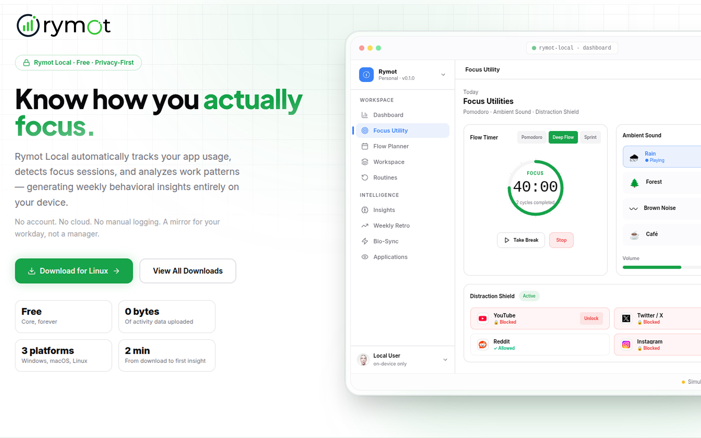

# Rymot Local

<!-- Banner Image Placeholder - Replace with your uploaded banner image -->

## Overview

Rymot Local is a personal cognitive operating system for modern knowledge work. It combines activity intelligence, focus tracking, behavioral analytics, cognitive insights, flow planning, and personal reflection into a single local-first experience.

### Core Philosophy

**Everything stays on your device.**

- ✓ No cloud account
- ✓ No data collection
- ✓ No external analytics

Just a deeper understanding of how you work.

---

## Features

- **Activity Intelligence** — Understand your work patterns and behaviors
- **Focus Tracking** — Monitor and optimize your concentration sessions
- **Behavioral Analytics** — Gain insights into your productivity rhythms
- **Cognitive Insights** — Personalized recommendations for better performance
- **Flow Planning** — Structure your work for optimal flow states
- **Personal Reflection** — Built-in tools for continuous self-improvement

---

## Getting Started

[Add installation instructions here]

## Documentation

[Add documentation links here]

## Contributing

[Add contribution guidelines here]

## License

[Add license information here]

---

**Made with ❤️ for knowledge workers who value privacy and deep work.**
