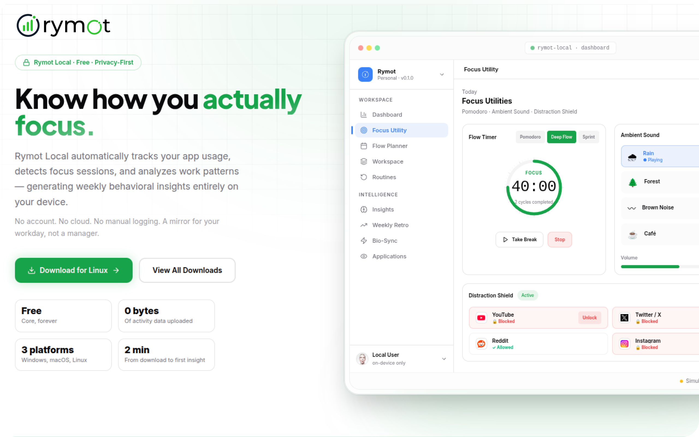

# Rymot Local

<!-- Banner Image Placeholder - Replace with your uploaded banner image -->

## Overview

Rymot Local is a personal cognitive operating system for modern knowledge work. It combines activity intelligence, focus tracking, behavioral analytics, cognitive insights, flow planning, and personal reflection into a single local-first experience.

### Core Philosophy

**Everything stays on your device.**

- ✓ No cloud account
- ✓ No data collection
- ✓ No external analytics

Just a deeper understanding of how you work.

---

## Features

- **Activity Intelligence** — Understand your work patterns and behaviors
- **Focus Tracking** — Monitor and optimize your concentration sessions
- **Behavioral Analytics** — Gain insights into your productivity rhythms
- **Cognitive Insights** — Personalized recommendations for better performance
- **Flow Planning** — Structure your work for optimal flow states
- **Personal Reflection** — Built-in tools for continuous self-improvement

### 🚀 Coming Soon: Distraction Shielding
- **App Blocking** — Automatically block distracting applications during focus sessions
- **Smart Timer Integration** — Seamlessly integrates with your work timer
- **Website Filtering** — Blocks distracting websites while you work
- **Focus Mode** — Keeps you on track across your device

---

## Getting Started

1. Clone or download Rymot Local
2. Install dependencies
3. Launch the application
4. Configure your profile and preferences
5. Start your first focus session

For detailed setup instructions and system requirements, refer to the [documentation](./docs).

---

## Documentation

For guides, API documentation, and detailed feature explanations, visit the [Rymot Local Documentation](./docs).

---

## Contributing

Rymot Local is currently source-available for discussion and feedback but is not accepting external code contributions at this time.

You can still help by:

- **Reporting bugs** — Help us identify and fix issues
- **Requesting features** — Share your ideas for improving Rymot
- **Suggesting integrations** — Let us know what tools you'd like to see integrated
- **Participating in discussions** — Join our community conversations
- **Sharing workflows and feedback** — Help us understand how you work best

Thank you for helping improve Rymot.

---

## Security

If you discover a security issue, please do not create a public issue.

**Contact:** security@rymot.io

We will investigate and respond as quickly as possible.

---

**Made with ❤️ for knowledge workers who value privacy and deep work.**
